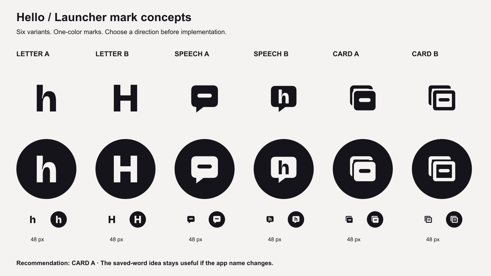
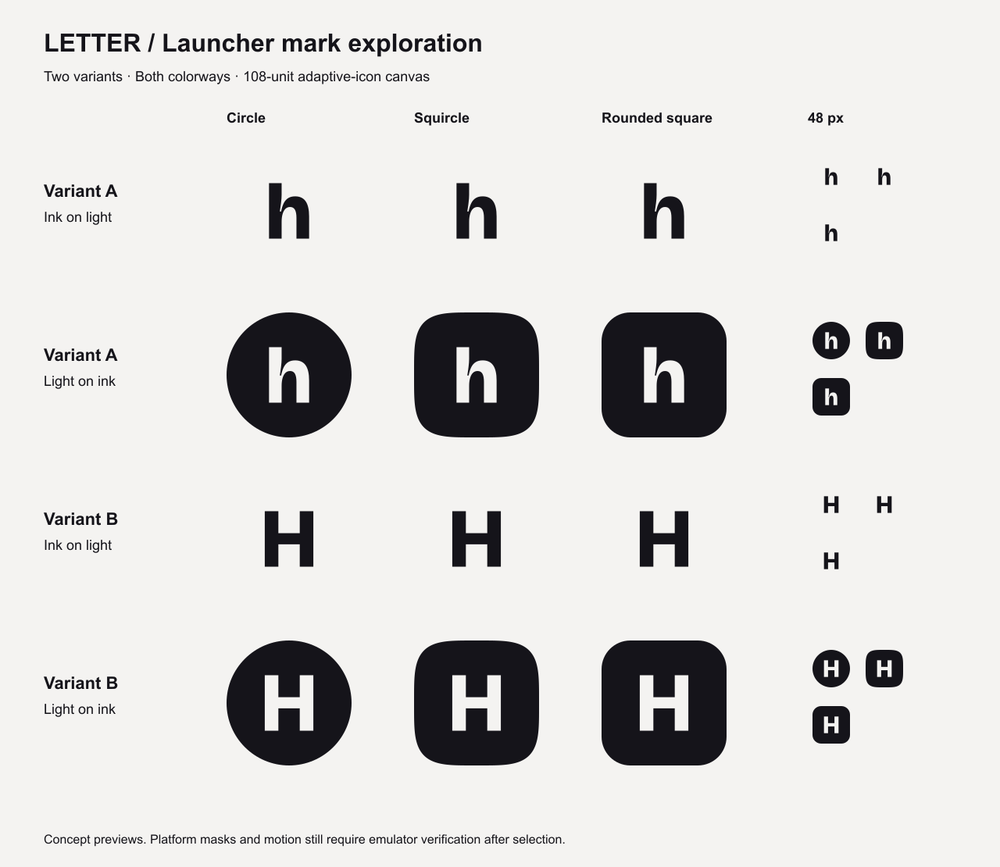
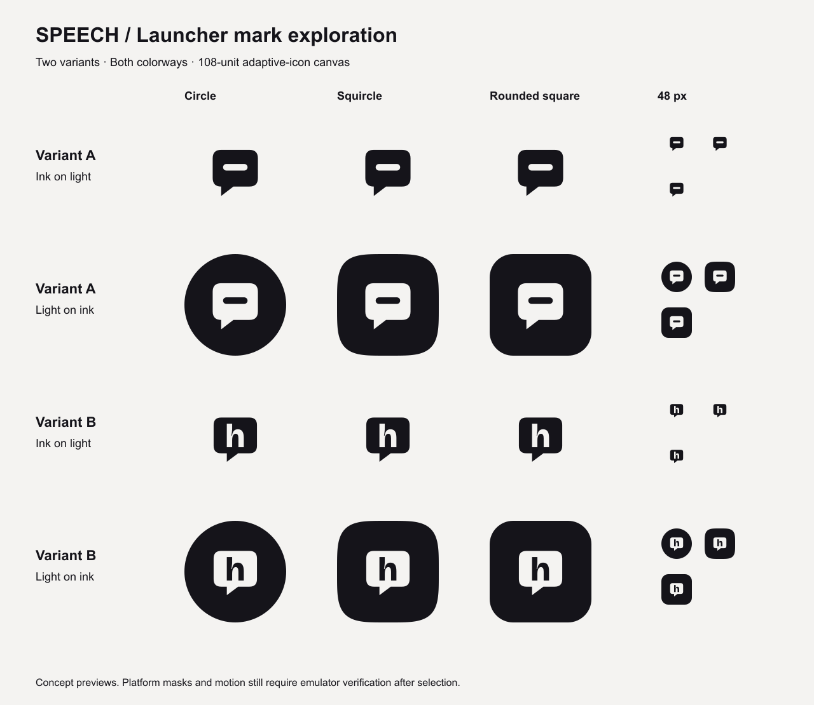
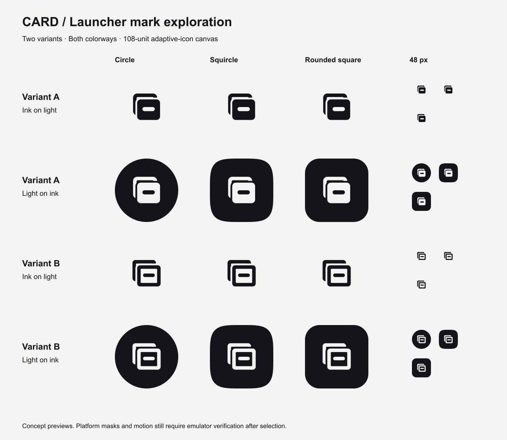

# Launcher mark concepts

Exploration for [issue #35](https://github.com/emm3000/hello/issues/35), prepared on 2026-10-05. Six variants are supplied in both colorways: ink `#15141A` on page `#F4F3F1`, and the inverse. Each concept PNG is 1024 × 1024. The editable SVGs use a 108 × 108 viewport, with the meaningful mark contained in its central 66-unit circle. These are concepts; the owner has not selected a mark, and Android resources have not been replaced.

## Letter

**A** is a lowercase `h`; **B** is uppercase `H`. Both use Bricolage Grotesque at weight 800, width 100 and optical size 48, converted to outlines and centered by glyph bounds. The lowercase has more personality; the uppercase has stronger symmetry. This is the quietest direction, but a single letter communicates little about saved vocabulary and depends on keeping Hello. I prefer A if the owner keeps the name. The outlined sources render without requiring the font to be installed.

## Speech

**A** is a compact filled bubble carrying a single saved-word line; **B** carries an outlined Bricolage lowercase `h` as negative space. Both connect capture with language. A works independently of the app name; B identifies Hello more explicitly. The tradeoff is a stronger association with chat or a speaking tutor than with the app's flashcard-review habit. I prefer A; its interior line also remains clearer at 48 pixels than B's smaller letter.

## Card

**A** has a filled front card, one cutout word line and an offset outline behind it; **B** uses an outlined front card with a filled line. Both express “a word saved as a card” and remain useful if the name changes. A carries more visual weight and its small preview keeps the front/back relationship clearer. B is lighter but its nested outlines can read as a window. **My recommendation is Card A, light on ink**: it is compact, reads at 48 pixels and represents the product's central action. The ink-on-light version remains available for the owner's comparison.

## Files and production handoff

- `concepts/<letter|speech|card>-<a|b>-<light|dark>.png`: 12 full-square concepts, 1024 × 1024.
- `sources/<direction>-<variant>-<light|dark>.svg`: the corresponding editable vector sources; no raster embedding, external font reference, gradient or shadow.
- `previews/<direction>.png`: one sheet per direction with circle, mathematical squircle (superellipse exponent 4), rounded square and native 48-pixel samples of all three masks.
- `previews/all-concepts.png`: the comparison sheet above.
- `sources/BricolageGrotesque-OFL.txt`: the font's redistribution license. Glyphs came from the [Google Fonts source](https://github.com/google/fonts/tree/main/ofl/bricolagegrotesque); the font file is not added to the app.

The foreground/negative-space construction uses one mark color plus its background, so the selected silhouette can become a monochrome VectorDrawable by combining its shapes and holes. These preview masks approximate launcher shapes; platform motion, themed icons, Recents and Settings remain the emulator checks for issue #36. This exploration does not claim that a resource has already been installed or tested on a device.

Record the direction, variant and colorway in issue #35, for example `card-a-dark`. Then issue #36 can translate that silhouette into the adaptive foreground and monochrome layer, with a solid background. Issue #37 produces the store assets after that choice; resolve the pending [app-name decision](../../APP_NAME_OPTIONS.md) before drawing the feature graphic's wordmark.

## Verification

The delivered files were checked for dimensions, SVG validity, colorway inversion and mark containment inside the radius-33 circle centered at `(54, 54)`. The three mask sheets and contact sheet were visually inspected; the 48-pixel samples preserve each mark's main structure. No Android or listing files are part of this work unit. The pre-commit Gradle gate and delivery checks are recorded in the PR when published. Rolling back this exploration removes only `docs/design/launcher-mark/` and leaves the app's current resources intact.
